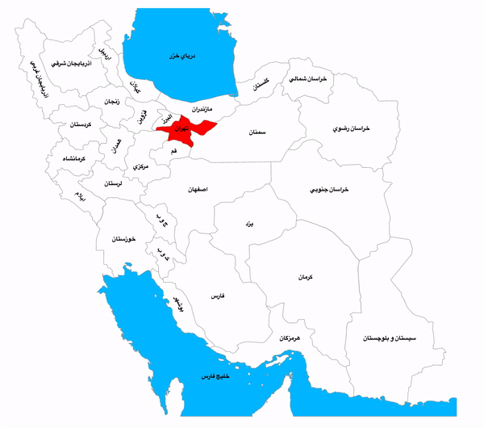

# iran-map

> interactive iran map. suitable for dashboards and any other kind of usage.

[](https://www.npmjs.com/package/iran-map) [](https://standardjs.com)

<div align="center">
    
</div>

## Install

```bash
npm install --save iran-map
```

## Usage

```jsx
import React, { Component } from 'react'

import InteractiveIranMap from 'iran-map'
import 'iran-map/dist/index.css'
import yourData from './yourData'

class Example extends Component {
  render() {
    return (
      <InteractiveIranMap
        height={600} // default value is 600px
        selectedArea={'tehran'} // default value is "tehran"
        data={yourData} // default value for all areas is 0
      />
    )
  }
}
```

## Data schema

```jsx
const yourData = {
  alborz: 0,
  ardebil: 0,
  azerbaijansharghi: 0,
  azerbaijangharbi: 0,
  bushehr: 0,
  chvab: 0,
  fars: 0,
  gilan: 0,
  golestan: 0,
  hamedan: 0,
  hormozgan: 0,
  ilam: 0,
  esfehan: 0,
  kerman: 0,
  kermanshah: 0,
  khorasanshomali: 0,
  khorasanrazavi: 0,
  khorasanjunubi: 0,
  khuzestan: 0,
  kvab: 0,
  kordestan: 0,
  lorestan: 0,
  markazi: 0,
  mazandaran: 0,
  ghazvin: 0,
  ghom: 0,
  semnan: 0,
  svab: 0,
  tehran: 0,
  yazd: 0,
  zanjan: 0,
  khazar: 0,
  khalijefars: 0,
  khark: 0,
  kish: 0,
  hormoz: 0,
  gheshm: 0,
  lark: 0,
  lavan: 0,
  faror: 0,
  hendorabi: 0,
  hengam: 0,
  siri: 0,
  abumusa: 0,
  tonbebozorg: 0,
  tonbekuchak: 0
}

export default yourData
```

## License

MIT © [alithecodeguy](https://github.com/alithecodeguy)
